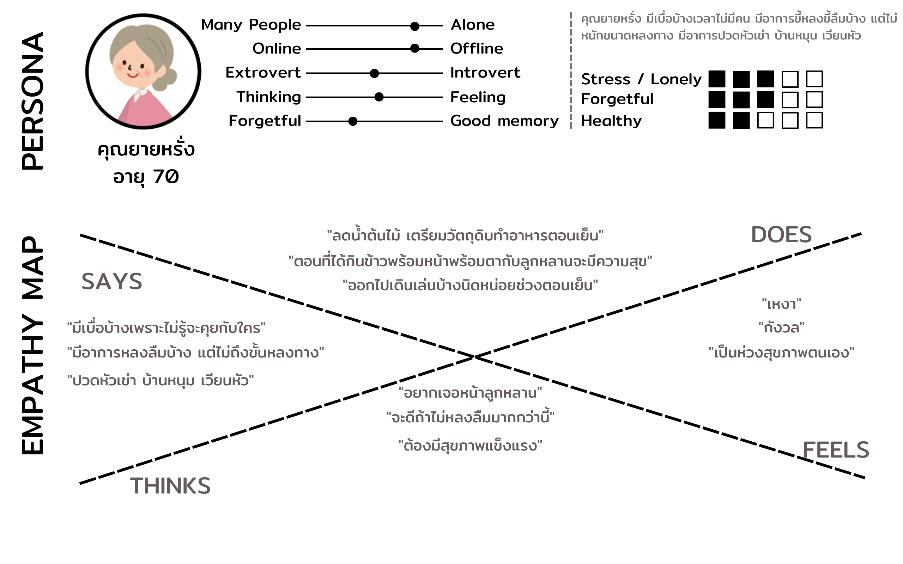
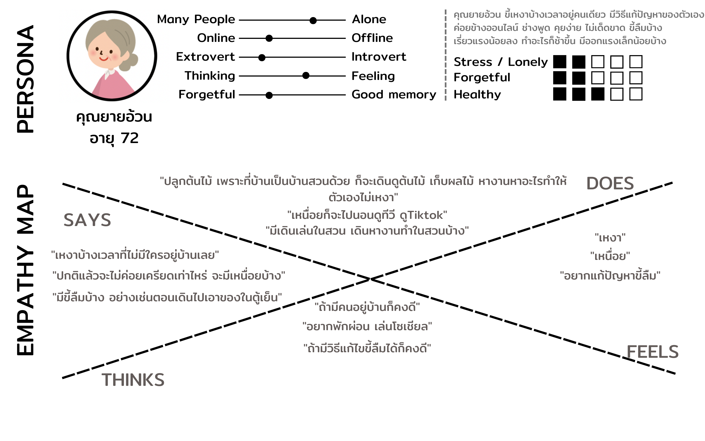
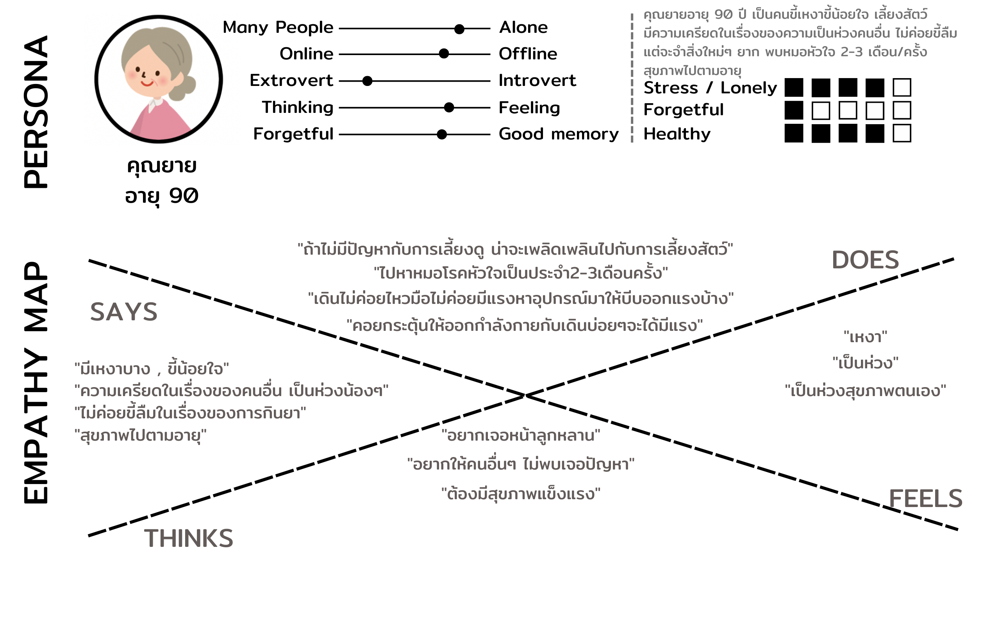
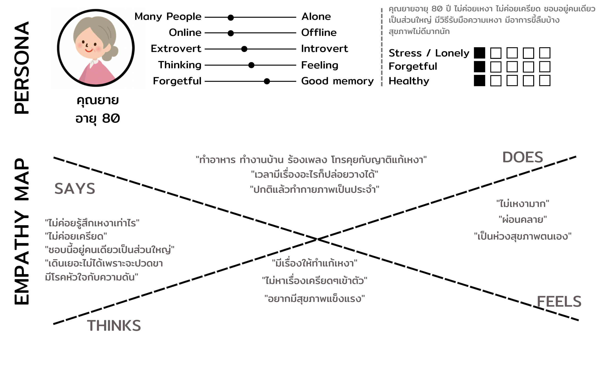

# User Persona and Say-Do-Think-Feel

  

 

### **Inferred as Think-Feel:** ยายเป็นคนขี้เหงา ขี้กังวล และอยากมีสุขภาพดีๆ

  

 

### **Inferred as Think-Feel:** ยายเป็นคนขี้เหงาอยากเจอหน้าลูกหลาน เหนื่อย และมีปัญหาความจำนิดหน่อย

  

 

### **Inferred as Think-Feel:** ยายเป็นคนความจำดี มีอาการเหงาบ้าง สุขภาพตกต่ำตามอายุ

  

 

### **Inferred as Think-Feel:** ยายเป็นคนไม่ค่อยขี้เหงา สามารถรับมื่อกับปัญหาตต่างๆได้ แต่มีปัญหาสุขภาพ
