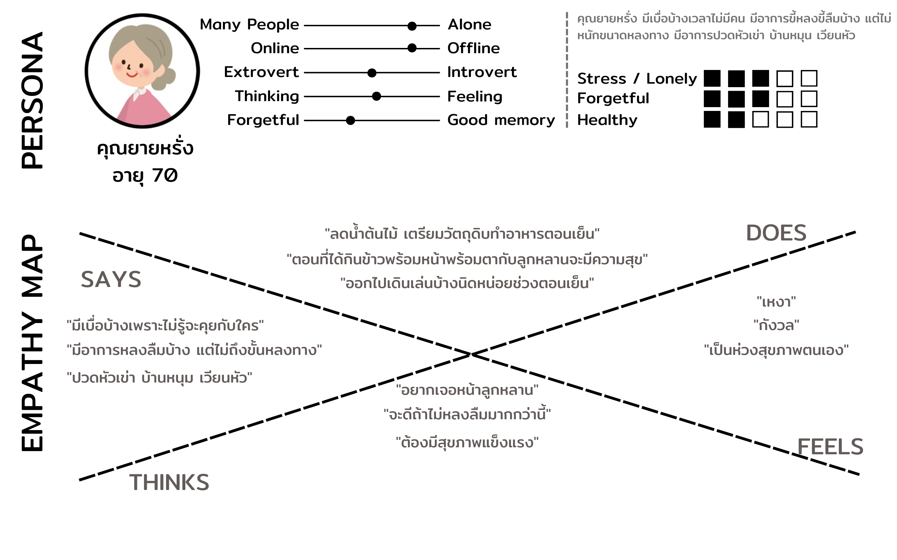
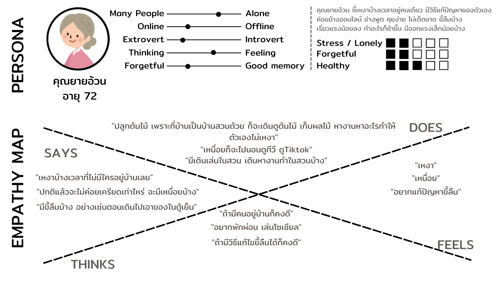
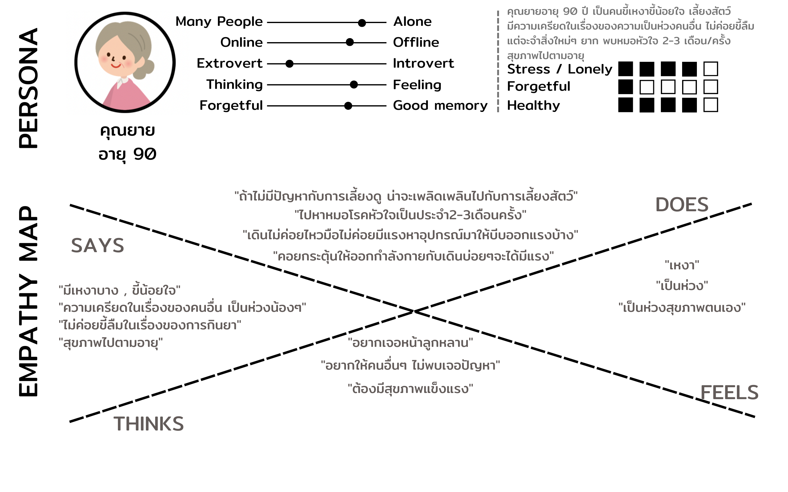
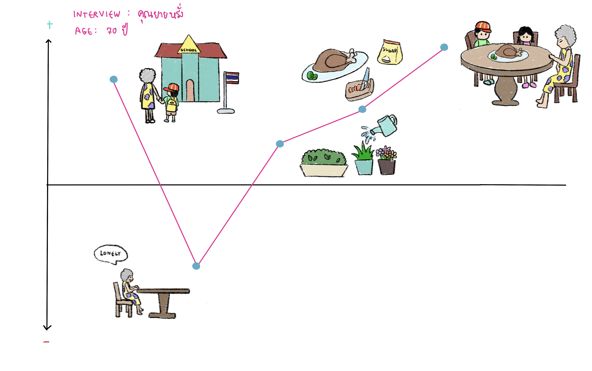
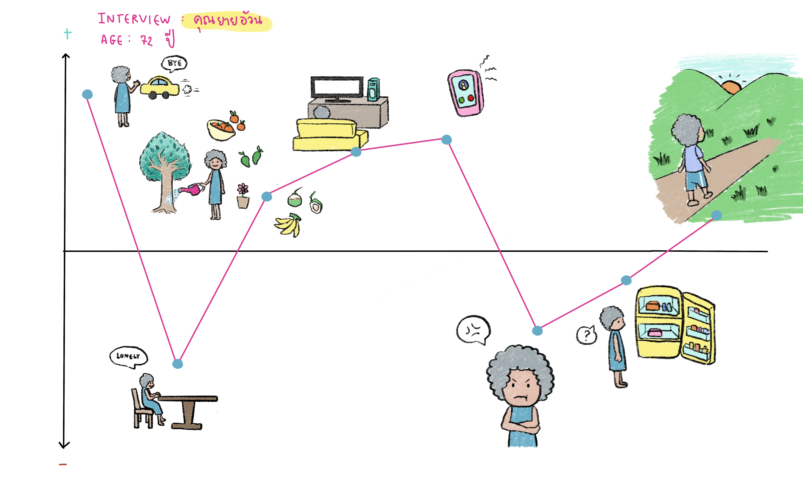
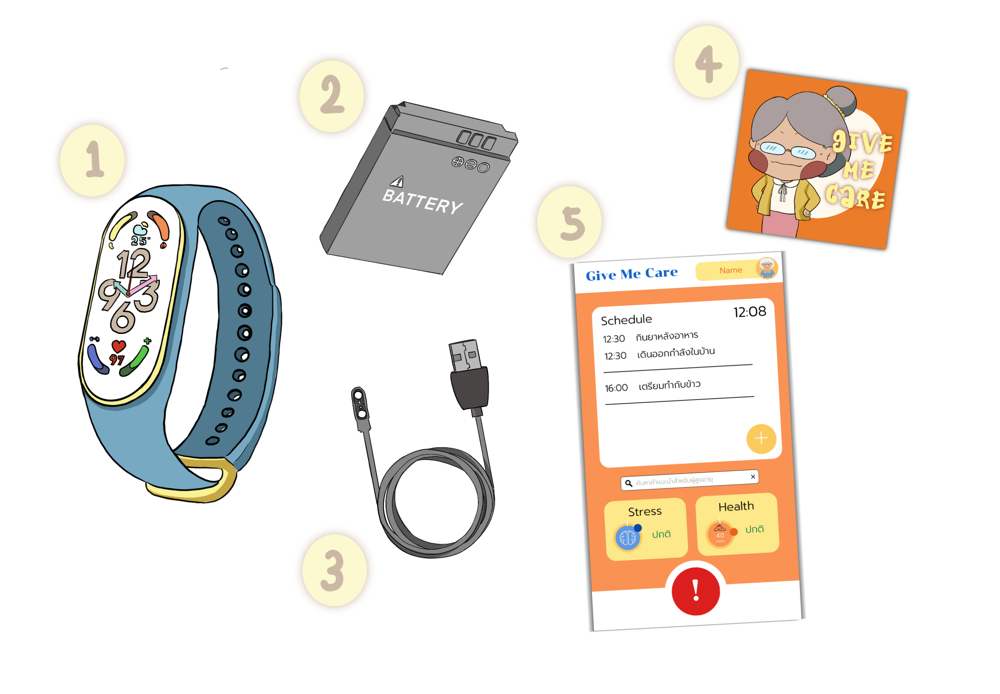
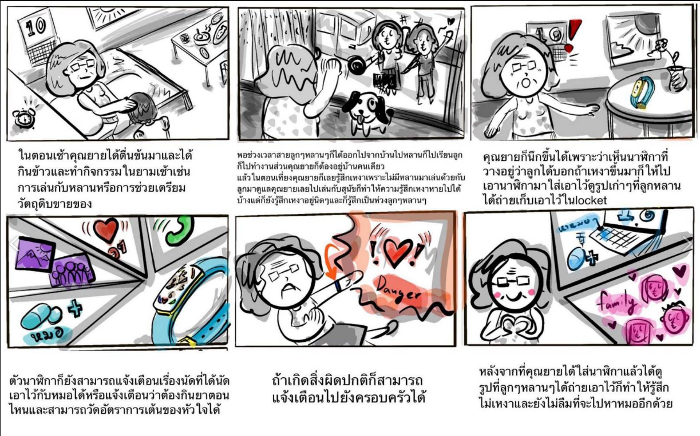
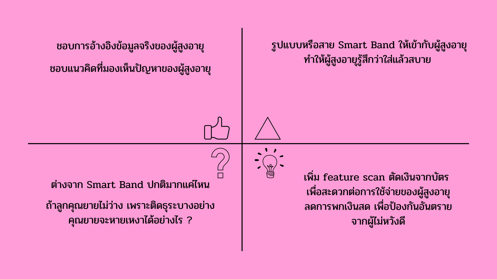

# Interview Script 🌳
### Form top *3 Poblems* in aging society
1. **exhausted** form age.
2. **stress** and **lonely**
3. easily to **forget**

#### out team see that smart band can solve 2nd and 3rd problem. so question is going to seperate to 2 part.
#### Part 1:
##### question for user persona 
- Is she/he ***alone***?
- Is she/he ***offline*** or ***online person***?
- Is she/he ***Introvert*** or ***Extrovert***?
- Is she/he base on ***feeling*** or ***thinking*** ?
- Is she/he ***forgetful*** or having ***good memory***?

#### Part 2:
##### question for Emphaty map
- What is the reason that make you facing problem?
- What is your solution for that problem?
- Why you choose this solution to?
- How is that solve your solution?

`So question going to base on Stress/Lonely and Forgetful.`

###### example:
คุณยายขี้เหงาหรือเครียดบ้างมั้ย?
อะไรที่ทำให้คุณยายขี้เหงา?
คุณยายมีวิธีแก้เหงายังไง?
ทำไมคุณยายถึงเลือกวิธีนี้?
มันแก้ปัญหาขี้เหงาให้คุณยายได้ยังไง?

# User Persona and Say-Do-Think-Feel

  

 

### **Inferred as Think-Feel:** ยายเป็นคนขี้เหงา ขี้กังวล และอยากมีสุขภาพดีๆ

  

 

### **Inferred as Think-Feel:** ยายเป็นคนขี้เหงาอยากเจอหน้าลูกหลาน เหนื่อย และมีปัญหาความจำนิดหน่อย

  

 

### **Inferred as Think-Feel:** ยายเป็นคนความจำดี มีอาการเหงาบ้าง สุขภาพตกต่ำตามอายุ

  

 

### **Inferred as Think-Feel:** ยายเป็นคนไม่ค่อยขี้เหงา สามารถรับมื่อกับปัญหาตต่างๆได้ แต่มีปัญหาสุขภาพ

# Jouney Maps

  

  

 

  

 

  

 

# PoV
------------
 >1. We Met:  คุณยายอายุ 90  ปี เป็นคุณยายของสมาร์ท คุณยายชอบขี้เหงาแล้วก็ขี้น้อยใจ แต่จะเลี้ยงสัตว์เพื่อคลายเหงา คุณยายชอบเครียดและห่วงน้องๆหลานๆ คุณยายไปหาหมอโรคหัวใจมา หมอให้คอยกระตุ้นคุณยายให้ออกกำลังกายกับเดินบ่อยๆจะได้มีแรง	 
 >2. We were surprised to notice:  ณยายเครียดและเป็นห่วงน้องๆกับหลานๆมาก นอกจากนี้คุณยายยังมือไม่ค่อยมีแรง และเดินไม่ค่อยไหวเนื่องจากน้ำหนักเยอะ
 >3. We wonder if this mean:  คุณยายอาจเครียดเกินไป คุณยายอาจเสี่ยงเป็นโรคซึมเศร้าหรือโรควิตกกังวลได้ และถ้าคุณยายไม่ออกกำลังกายบ้างสุขภาพของคุณยายอาจจะแย่ลงไปอีก แล้วก็จะไม่ค่อยมีแรงด้วย
 >4. It would be game-changing to:  ถ้าคุณยายเริ่มออกกำลังกายบ้างจะทำให้สุขภาพของคุณยายดีขึ้น มีแรง สดใสขึ้น
		 
------------

# Ideate artifacts and final elected idea(s)

  

 
from discussing, our team choosing mi band as a prototype because is cheap and have everything we need init, like tracking stress meter etc. 

# Prototype

  

this is prototype of smart-band that attach to aged. we designed based on mi-band and make it more useable with aged person.

  

this is prototype of mobile-application that work with smart-band. use to recive data and display on mobile

# Test script, story telling, storyboard
## Test script
คุณยายได้อยู่บ้านคนเดี๋ยวเพราะลูกหลานได้มีหน้าที่การงานแตกต่างกันออกไป ทำให้คุณยายรู้สึกเหงาเลยไปเล่นกับสุขนัขเพื่อให้ลืมความเหงาไปได้บ้างก็ยังดี แต่พอเล่นไปสักพักก็ยังรู้สึกเหงาและเป็นห่วงลูกๆหลานๆอยู่ดี คุณยายเลยไปเอานาฬิกาที่หลานได้ให้เอาไว้ 
โดยหลานบอกว่าถ้าเหงาก็ส่วมนาฬิการเพื่อสามารถดูรูปเก่าๆที่ลูกหลานถ่ายส่งเอาไว้ได้ผ่านแอพพลิเคชั่นlocket และยังช่วยในเรื่องการนัดไปหาหมอและกินยาให้ตรงเวลาหรือวัดการเต้นของหัวใจเมื่อเต้นผิดจังหวะก็ยังส่งไปหาคนในครอบครัวได้ 
หลังคุณยายได้ส่วมนาฬิกาทำให้คุณยายได้นึกถึงวันเก่าๆที่มีเวลากินข้าวอยู่พร้อมกันและยังไม่ลืมไปหาหมอให้ตรงเวลาอีกด้วย 

## story telling
ในตอนเช้าคุณยายได้ตื่นข้นมาและได้กินข้าวและทำกิจกรรมในยามเช้าเช่นการเล่นกับหลานหรือการช่วยเตรียมวัตถุดิบขายของ
พอช่วงเวลาสายลูกๆหลานๆก็ได้ออกไปจากบ้านไปหลานก็ไปเรียนลูกก็ไปทำงานส่วนคุณยายก็ต้องอยู่บ้านคนเดียว
แล้วในตอนเที่ยงคุณยายก็เลยรู้สึกเหงาเพราะไม่มีหลานมาเล่นด้วยกับลูกมาดูแลคุณยายเลยไปเล่นกับสุนัขก็ทำให้ความรู้สึกเหงาหายไปได้บ้างแต่ก็ยังรู้สึกเหงาอยู่นิดๆและก็รู้สึกเป็นห่วงลูกๆหลานๆ
คุณยายก็นึกขึ้นได้เพราะว่าเห็นนาฬิกาที่วางอยู่ว่าลูกได้บอกถ้าเหงาขึ้นมาก็ให้ไปเอานาฬิกามาใส่เอาไว้ดูรูปเก่าๆที่ลูกหลานได้ถ่ายเก็บเอาไว้ในlocketและตัวนาฬิกาก็ยังสามารถแจ้งเตือนเรื่องนัดที่ได้นัดเอาไว้กับหมอได้หรือแจ้งเตือนว่าต้องกินยาตอนไหนและสามารถวัดอัตราการเต้นของหัวใจได้และถ้าเกิดสิ่งผิดปกติก็สามารถแจ้งเตือนไปยังครอบครัวได้หลังจากที่คุณยายได้ใส่นาฬิกาแล้วได้ดูรูปที่ลูกๆหลานๆได้ถ่ายเอาไว้ก็ทำให้รู้สึกไม่เหงาและยังไม่ลืมที่จะไปหาหมออีกด้วย

## storyboard

  

# Feedback matrix from test

  

# Describe what your next mode(s) should be based on user feedback
- ปรับปรุงดีไซน์ ให้เหมาะกับผู้สูงอายุ ออกแบบให้ใส่สบาย
- ปรับให้ฟีเจอร์ใน smart band ให้เข้าใจง่ายเหมาะกับผู้สูงอายุ 
- ปรับตัวอักษรเห็นชัดมองเห็นง่ายสำหรับผู้สูงอายุ
- เพิ่ม feature จ่ายเงินผ่านบัตรเพื่อสะดวกต่อการใช้จ่ายของผู้สูงอายุลดการพกเงินสด 
- เพิ่ม feature gps ไว้สำหรับตามตัวผู้ป่วยที่เป็นโรคอัลไซเมอร์ได้
