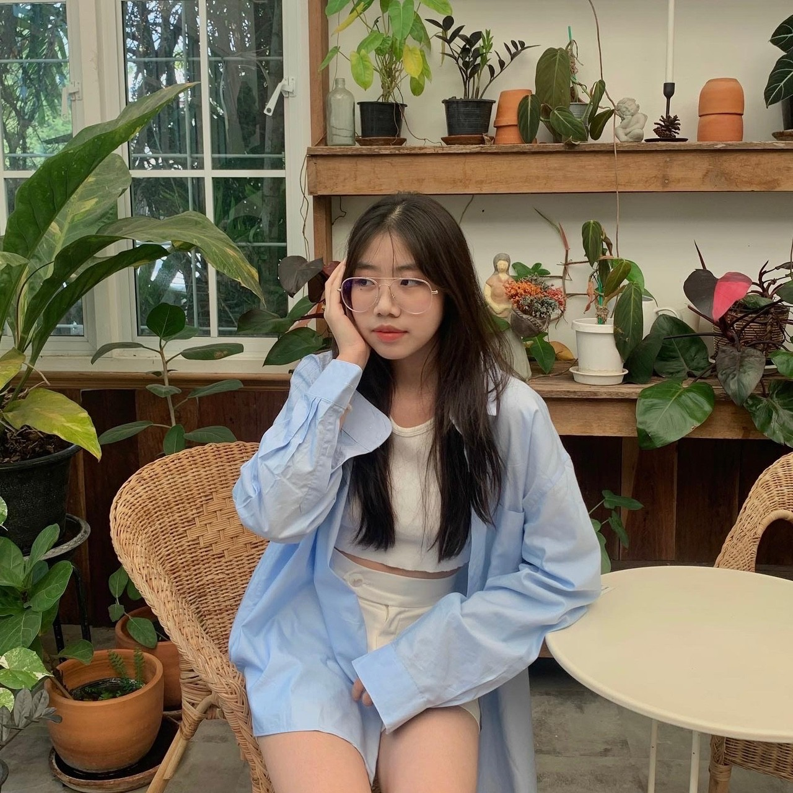
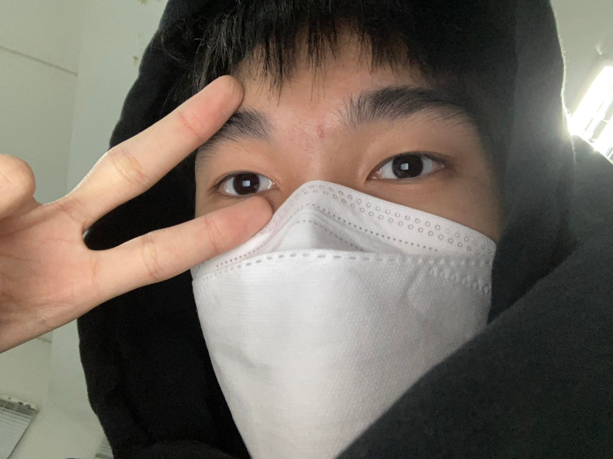
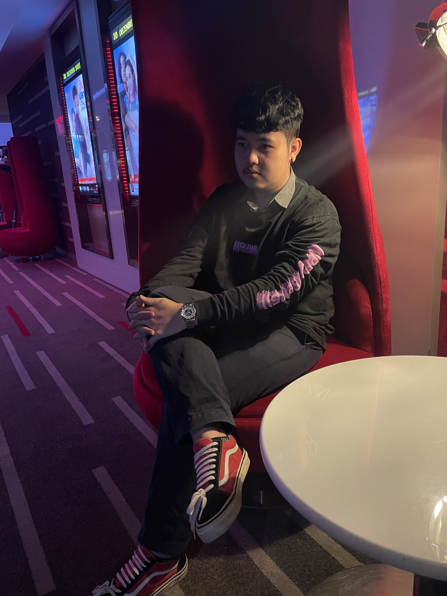
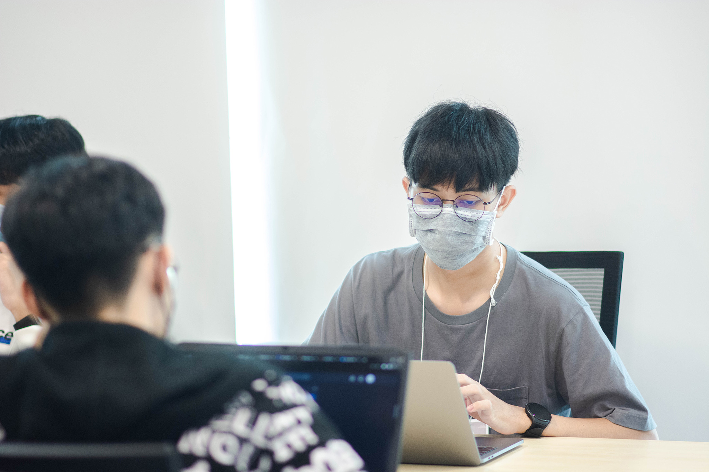
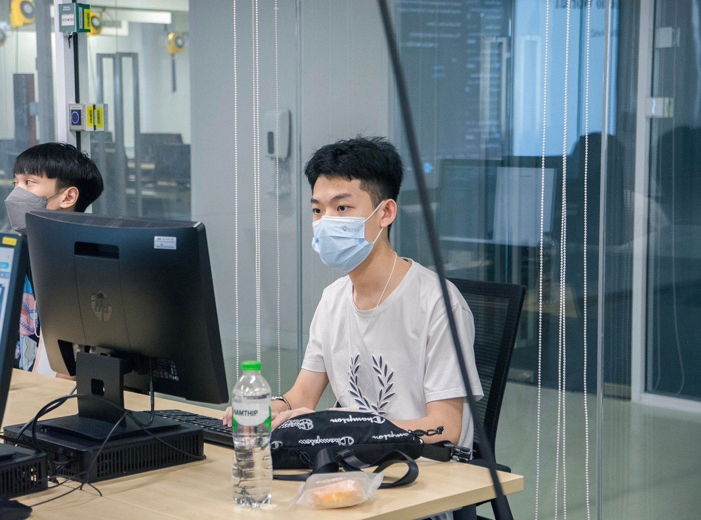
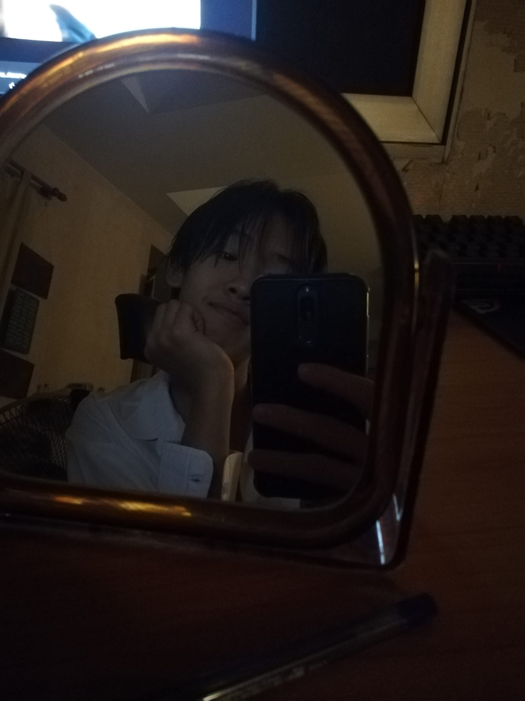
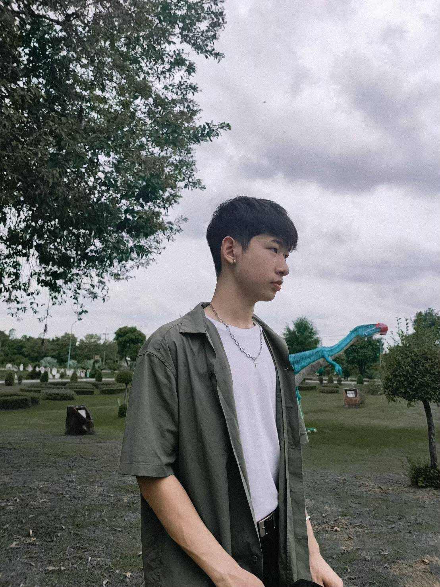

<h1 align="center">
Our team information!
</h1>

<!-- ----------------Jinnawat Vilairat------------------ -->

  

## 1). Thanachanok Banjongjinda 
#### [Instagram Contact](https://instagram.com/arenleys?igshid=YmMyMTA2M2Y=)

 - **ชื่อที่อยากให้เพื่อนเรียก:** เอิร์น & ครัวซองค์ :croissant:	
 - **จังหวัดเกิด:** กรุงเทพ ฯ
 - **สีที่ชอบ:** ชมพู `rgb(255,192,203)` :soap:
 - **วงดนตรี/ศิลปินที่ชอบ:** [Zweed n’roll](https://www.youtube.com/channel/UCwAs_r3T4QPxlwnIpZH775g) :musical_note:
 - **กีฬาที่ชอบ:** แบดมินตัน :badminton:	
 - **วันเกิด:** 9 กุมพาพันธ์ 2547
 - **อาหารที่ชอบ:** ข้าวไข่ข้นเบคอน
 - **สัตว์เลี้ยงที่ชอบ:** สุนัขพันธุ์ Golden Retriever :dog2:	
 
` จากการสัมภาษณ์ 'เอิร์น' ตอนแรกคิดว่าเอิร์นเป็นคนเข้าถึงยาก เป็นคนที่มีบ้านอยู่ในตัวกรุงเทพฯ จึงจำเป็นต้องเดินทางไปกลับทุกวัน ทำให้ไม่มีโอกาสได้คุยกันมากเท่าไหร่ แต่เมื่อมีโอกาสได้คุยกับตอนสัมภาษณ์ เอิร์นเป็นคนเฟรนด์ลี่ เข้าถึงง่าย และสนิทง่าย เป็นคนที่สามารถปรึกษาและพึ่งพาได้ มีรสนิยมดนตรีที่คล้ายกัน และเหมือนกันในหลายๆอย่าง ทำให้อยู่ด้วยกันแล้วสบายใจ`
###### Interviewed by _Jinnawat Vilairat_

<h1>
</h1>

<!-- -------------------Pakin Bunthr-------------------- -->

  

### 2). Veerapat Dujyongthummakhun	
#### [Instagram Contact](https://www.instagram.com/veerapat_a_/)
 
 - **ชื่อที่อยากให้เพื่อนเรียก:** อั๋น
 - **จังหวัดเกิด:** กรุงเทพ ฯ
 - **สีที่ชอบ:** เขียว`rgb(0,255,0)`:green_heart:	
 - **วงดนตรี/ศิลปินที่ชอบ:** [Tattoo color](https://www.facebook.com/tattoocolour/) :notes:	
 - **กีฬาที่ชอบ:** บาสเกตบอล :basketball:	
 - **วันเกิด:** 20 กันยายน 2546
 - **อาหารที่ชอบ:** สเต็ก :shallow_pan_of_food:	
 - **สัตว์เลี้ยงที่ชอบ:** แมว :cat2:	
 
` จากการสัมภาษณ์อั๋น อั๋นเป็นเพื่อนที่ชอบและรักการเล่นบาสเกตบอลเป็นอย่างมาก เพื่อนเป็นคนนิสัยดี คุยสนุกเข้าถึงง่าย ทำให้ได้ทำกิจกรรมร่วมกันหลายอย่าง เช่น เล่นกีฬาบาสเกตบอล และหลังจากได้เรียนด้วยกันมา
 เพื่อนมีความตั้งใจในการเรียนเป็นอย่างมาก และหมั่นศึกษาหาความรู้ใหม่ๆอยู่เสมอ และได้ทราบอีกว่าเพื่อนชอบสัตว์เลี้ยงชนิดเดียวกันกับผม คือ แมว `
###### Interviewed by _Pakin Bunthr_ :pig:

<h1>
</h1>

<!-- -------------Thanachanok Banjongjinda-------------- -->

  

### 3). Pakin Bunthr
#### [Instagram Contact](https://www.instagram.com/kinx_s1va/)
 
 - **ชื่อที่อยากให้เพื่อนเรียก:** คิน
 - **จังหวัดเกิด:** สมุทรปราการ
 - **สีที่ชอบ:** 
    - แดง`rgb(255,0,0,)`:red_circle:
    - ดำ`rgb(0,0,0)`:black_circle:
    - ขาว`rgb(255,255,255)`:white_circle:	
 - **วงดนตรี/ศิลปินที่ชอบ:** [คณะขวัญใจ](https://www.facebook.com/KhanaKwanjai)
 - **กีฬาที่ชอบ:** สนุ๊กเกอร์:8ball:	
 - **วันเกิด:** 14/08/46
 - **อาหารที่ชอบ:** ผัดพริกแกงหมูกรอบไข่ข้น 
 - **สัตว์เลี้ยงที่ชอบ:** แมว:smiley_cat:	
 
` จากการสัมภาษณ์'คิน'ในตอนแรกก่อนที่จะได้รู้จักกับคิน คินดูเป็นคนที่ค่อนข้างจริงจังกับการทำงาน อารมณ์ดี ใจดี แล้วก็ดูเข้ากับคนอื่นคนอื่นได้ง่าย ซึ่งหลังจากสัมภาษณ์ก็รู้สึกได้ว่าคินดูเป็นคนแบบนั้นจริงๆ นอกจากนั้นแล้วคินก็เป้นคนที่รักแมว ทำให้ดูมีความอ่อนโยน สีที่คินชอบก็คือสีดำ แดง ขาว ดูเท่และเข้ากับนิสัยคินมากๆ คิดว่าถ้าคนไม่เคยคุยกับคินอาจจะคิดว่าคินค่อนข้างเข้าถึงยากพอสมควร แต่ถ้าได้คุยจริงๆจะรู้ว่าคินไม่ได้เข้าถึงยากขนาดนั้นเลย`
###### Interviewed by _Thanachanok Banjongjinda_

<h1>
</h1>

<!-- ------------Pongsapat Charoencharuskul------------- -->

  

### 4). Jinnawat Vilairat
#### [Instagram Contact](https://www.instagram.com/jinn.palmy_)
 
 - ชื่อที่อยากให้เพื่อนเรียก: ปาล์ม
 - จังหวัดเกิด: ฉะเชิงเทรา
 - สีที่ชอบ: ดำ`rgb(0,0,0)`:black_medium_square:	
 - วงดนตรี/ศิลปินที่ชอบ: [Camellia](https://www.youtube.com/c/Kamelcamellia):headphones:	
 - กีฬาที่ชอบ: กรีทา:runner:
 - วันเกิด: 2 ธันวาคม 2546
 - อาหารที่ชอบ: ราเมน:ramen:	
 - สัตว์เลี้ยงที่ชอบ: สุนัขพันธุ์ French Bulldog:dog:	
 
` จากการสัมภาษณ์ปาล์ม ก่อนที่จะได้รู้จักกันปาล์มดูเป็นคนเงียบๆ แต่พอได้คุยกันปาล์มเป็นคนที่คุยง่าย เป็นคนที่ง่ายๆ อะไรก็ได้ และจากการเรียนรวมถึงการทำงานกลุ่มด้วยกันก็ทำให้ได้รู้ว่าปาล์มเป็นที่มีความเป็นผู้นำสูง แบ่งงานและช่วยเหลือเพื่อนในกลุ่มได้เป็นอย่างดี มีงานอดิเรกคือ ชอบอ่านหนังสือการ์ตูน ดูอนืเมะ  เล่นเกมหลากหลายแนวทั้ง valorant osu รวมถึงการออกกำลังกาย วิ่ง  `
###### Interviewed by _Pongsapat Charoencharuskul_

<h1>
</h1>

<!-- ----------------Nattapat Thaworn------------------ -->

  

### 5). Pongsapat Charoencharuskul
####[Instagram Contact](https://www.instagram.com/_tongpc/)
 
 - **ชื่อที่อยากให้เพื่อนเรียก:** ตอง
 - **จังหวัดเกิด:** กรุงเทพ ฯ
 - **สีที่ชอบ:** เขียว`rgb(0,255,0)`:green_book:	
 - **วงดนตรี/ศิลปินที่ชอบ:** [Tarik](https://open.spotify.com/artist/50fXnXorfeP9GKt1QZxgO3):microphone:	
 - **กีฬาที่ชอบ:** ฟุตบอล:soccer:	
 - **วันเกิด:** 9 กุมภาพันธ์ 2547
 - **อาหารที่ชอบ:** ทงคัตสึ:bento:	
 - **สัตว์เลี้ยงที่ชอบ:** สุนัข:service_dog:	
 
` จากการสัมภาษณ์ตอง ก่อนที่จะได้รู้จักกับตองตองเป็นคนที่ดูนิ่งๆ แต่หลังจากที่เรียนด้วยกัน 2 อาทิตย์ก็ทำให้รู้ว่าจริงๆตองเป็นคนเฟรนลี่ เข้ากับคนอื่นง่าย ตอนทำงานกลุ่มด้วยกันในคาบตองก็ช่วยนำเสนองานต่างๆและช่วยเหลือเพื่อนๆได้เป็นอย่างดี`
###### Interviewed by _Nattapat Thaworn_

<h1>
</h1>

<!-- -------------Veerapat Dujyongthummakhun----------- -->

  

### 6). Noppakrit Nitichaisatit
#### [Instagram Contact](https://www.instagram.com/smootysmart/)

 - **ชื่อที่อยากให้เพื่อนเรียก:** สามารถ/แชมเปี้ยน
 - **จังหวัดเกิด:** กรุงเทพ ฯ
 - **สีที่ชอบ:** ฟ้า`rgb(5,195,221)`:large_blue_circle:	
 - **วงดนตรี/ศิลปินที่ชอบ:** [Tilly birds](https://www.facebook.com/TILLYBIRDS):guitar:	
 - **กีฬาที่ชอบ:** บาสเกตบอล:basketball_man:
 - **วันเกิด:** 10 ก.ย. 2546
 - **อาหารที่ชอบ:** มักกะโรนี:stew:	
 - **สัตว์เลี้ยงที่ชอบ:** สุนัขพันธ์ Pomeranian:dog:	
 
` จากการสัมภาษณ์ตอง ก่อนที่จะได้รู้จักกับตองตองเป็นคนที่ดูนิ่งๆ แต่หลังจากที่เรียนด้วยกัน 2 อาทิตย์ก็ทำให้รู้ว่าจริงๆตองเป็นคนเฟรนลี่ เข้ากับคนอื่นง่าย ตอนทำงานกลุ่มด้วยกันในคาบตองก็ช่วยนำเสนองานต่างๆและช่วยเหลือเพื่อนๆได้เป็นอย่างดี`
###### Interviewed by _Veerapat Dujyongthummakhun_

<h1>
</h1>

<!-- ---------------Noppakrit Nitichaisatit------------- -->

  

### 7). Nattapat Thaworn
####[Instagram Contact](https://www.instagram.com/p_ntpt)
 
 - **ชื่อที่อยากให้เพื่อนเรียก:** เปรม
 - **จังหวัดเกิด:** กาฬสินธุ์
 - **สีที่ชอบ:** ฟ้า`rgb(5,195,221)`:blue_square:	
 - **วงดนตรี/ศิลปินที่ชอบ:** [The boyz](https://www.youtube.com/c/THEBOYZofficial/videos):studio_microphone:	
 - **กีฬาที่ชอบ:** แบตมินตัน:badminton:	
 - **วันเกิด:** 18 มีนาคม 2547
 - **อาหารที่ชอบ:** แซลม่อน:fish:	
 - **สัตว์เลี้ยงที่ชอบ:** จิ้งจอก:fox_face:
 
` จากการสัมภาษณ์เปรม ในตอนแรกคิดว่าเปรมเป็นคนกรุงเทพและคิดว่าเป็นคนที่เฟรนลี่แล้วพอสัมภาษณ์ทำให้รู้ว่าเปรมไม่ใช่คนกรุงเทพแต่เป็นคนกาฬสินธุ์แต่เป็นคนเฟรนลี่ยางมี่คิดไว้จริงๆและเปรมยังเป็นคนที่ชอบเล่นกีฬาแบตมินตันและยังชอบที่จะกินแซลม่อนกับอาหารญี่ปุ่นอื่นๆอีกด้วยแล้วเปรมก็ชอบสีฟ้าและชื่อชอบจิ้งจอก`
###### Interviewed by _Noppakrit Nitichaisatit_
